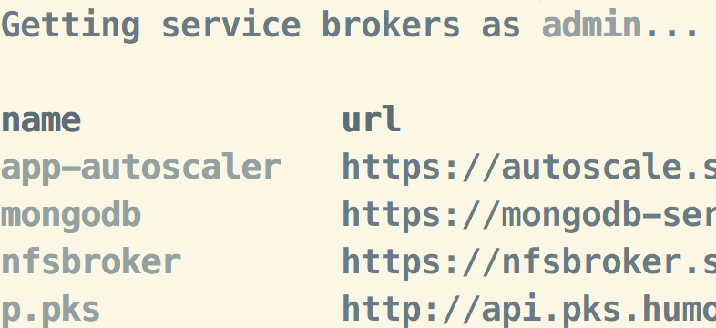
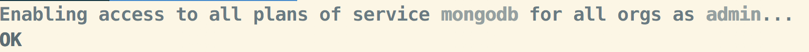
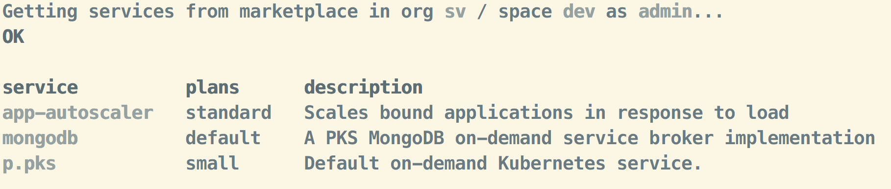
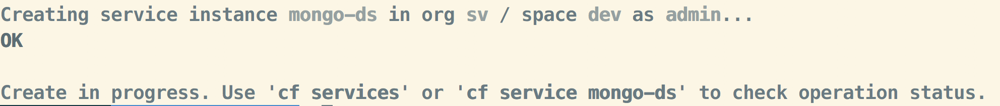
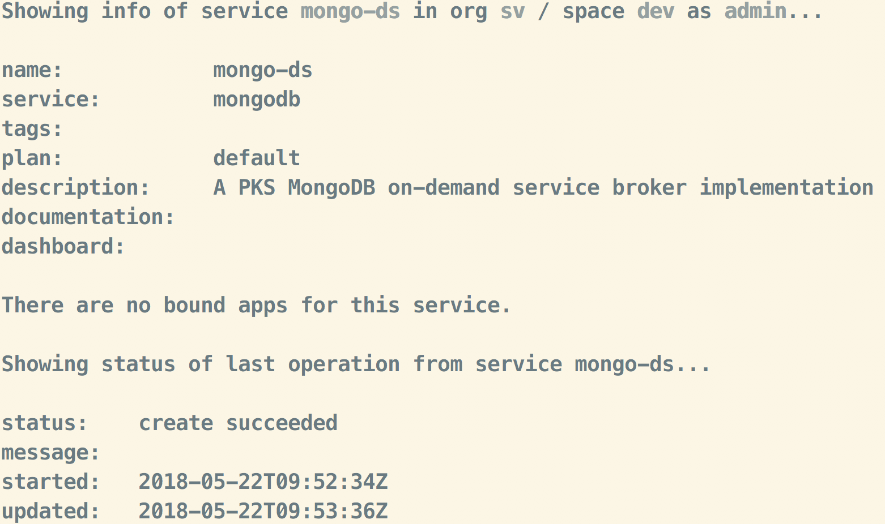

= Overview

This project https://github.com/srinivasa-vasu/cloudfoundry-mongodb-service-broker.git[mongodb-ondemand-cf-broker] uses the Spring Cloud - Cloud Foundry Service Broker to implement a fully functional kubernetes statefulset MongoDB as a service. The MongoDB service also uses https://github.com/spring-projects/spring-boot/tree/master/spring-boot-starters/spring-boot-starter-data-mongodb[spring-boot-data-mongodb] to persist service instances and bindings.

This spring Boot project using the https://github.com/spring-cloud/spring-cloud-cloudfoundry-service-broker/tree/1.0.x[Spring Cloud - Cloud Foundry Service Broker 1.x].

== Getting Started

This service broker's `create service instance` call will install and configure a fully functional distributed MongoDB on Kubernetes.

You have to configure the connectivity details in link:manifest.yml[manifest.yml] or link:src/main/resources/application.yml[application.yml].

=== Build :: Broker App
Update endpoint info. Update mongodb *mongodb_host* and *mongodb_port* info in *manifest.yml* or *src/main/resources/application.yml*

* manifest.yml
```
env:
    MONGODB_HOST: <host>
    MONGODB_PORT: <port>
```
_host and port would be your LB info which would be made available to allow access to kubernetes cluster mongodb service. This could be either `an LB` or `an individual VM` or `a TCP ingress endpoint`._

* src/main/resources/application.yml
```
mongodb:
  host: x.x.x.x
  port: 31000
```
_Make the change in one of the two places_

* Build it
```
./gradlew -x test clean build
```    
* Note: Test cases are not fully written yet and hence some of the tests may not pass    

After building, you have to push the broker app to Cloud Foundry

=== Push :: Broker App

* Login to cloud foundry 
```
cf login -a <login_api_endpoint> --skip-ssl-validation 
```
* Better to target `system` organization
```
cf target -o system 
```
* Create a space named `sb-service-broker`
```
cf create-space sb-service-broker 
```
* Update manifest info (manifest.yml) to change the route (replace <> with your domain name) to your own system/app domain
```
applications:
- name: mongodb-service-broker
  memory: 756M
  instances: 1
  path: build/libs/service-broker-mongodb.jar
  routes:
  - route: mongodb-service-broker.<system/app domain>
  env:
    SECURITY_USER_NAME: admin
    SECURITY_USER_PASSWORD: admin 
```
* cf push

_Note down the route url_

=== Create :: Service Broker

* Create broker
```
cf create-service-broker mongodb admin admin <url>
```
Replace `<url>` with the route url from `cf push` step

* List brokers
```
cf service-brokers
```


_You should be able to see the `mongodb` service broker_

* Enable service access
```
cf enable-service-access mongodb
```


=== Create :: Service

* Switch to a development space
```
cf target -o <dev_org> -s <dev_space>
```
_Replace `<dev_org>` and `<dev_space>` with the actual values_

* List marketplace
```
cf marketplace
```


_You should be able to see the `mongodb` service_

* Create mongodb service
```
cf create-service mongodb default mongo-ds -c '{"master_url": "<kubernetes_master_url>", "namespace": "<namespace>", "service_name": "<mongodb_deployment_name>", "token": "<user_access_token_from_kube_config_file>"}'
```
_Replace placeholders `<>` with actual values_

* `master_url`: K8s cluster master url. Will be like `https://35.100.20.23:8443`
* `namespace`: namespace/project that holds k8s objects of mongodb like deployment, service manifests etc.
* `service_name`: mongodb deployment name
* `token`: user access token from kube config file

`create-service` will provision mongodb database on the given kubernetes cluster asynchronously. You should get a response like,


* Check service creation status
```
cf service mongo-ds
```
image:images/create-service-status.png[create-service-status]

Within few seconds, status should be successful.



=== Bind :: Service

Push https://github.com/cloudfoundry-samples/spring-music.git[spring-music] to the development space by binding the mongodb service instance

* Update spring-music manifest to include the bind-service entry
```
applications:
- name: spring-music
  memory: 756M
  random-route: true
  path: build/libs/spring-music-1.0.jar
  services:
  - mongo-ds
```
* Push the app to the same space
```
cf push
```

Verify the results in a web browser
